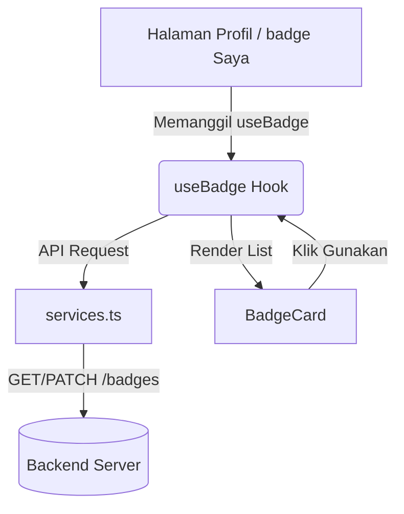

# Dokumentasi Fitur badge Digital (Digital Nudge Badge)

Fitur **Digital Nudge Badge** (badge Digital) dirancang untuk memberikan insentif psikologis (nudge) kepada pengguna—baik Pemerintah Desa maupun Inovator—untuk terus aktif berpartisipasi dalam ekosistem Desa Digital Indonesia. Pengguna dapat memperoleh badge tertentu setelah memenuhi kriteria/aktivitas tertentu di platform, lalu memilih satu badge aktif untuk dipamerkan di profil mereka.

---

## 📁 Struktur Folder

Fitur ini diorganisasikan dalam satu modul terisolasi `src/features/digital-nudge`:

```text
src/features/digital-nudge/
├── components/
│   └── BadgeCard.tsx         # Komponen UI untuk merender badge
├── hooks/
│   └── useBadge.ts           # Custom React hook untuk manajemen state badge
├── constants.ts              # Konfigurasi gaya visual, warna, dan ikon tiap badge
├── services.ts               # Fungsi panggilan API ke backend
└── types.ts                  # Definisi tipe data TypeScript untuk Badge
```

---

## 📄 Penjelasan File Utama

### 1. `types.ts`
Mendefinisikan kontrak data antara frontend dan backend.

```typescript
export interface Badge {
  id: string;          // Identifier unik badge (e.g., 'penggerak_inovasi')
  name: string;        // Nama badge yang ditampilkana
  description: string; // Deskripsi persyaratan/tujuan badge
  icon: string;        // Path ke file ikon SVG
  isUnlocked: boolean; // Apakah pengguna sudah berhasil membuka badge ini
  progress: number;    // Progress saat ini dalam memenuhi syarat
  target: number;      // Target pencapaian untuk membuka badge
}

export interface BadgeEvaluationResponse {
  activeBadge: string | null; // ID badge yang sedang dipasang (aktif)
  badges: Badge[];            // Daftar semua badge beserta status pencapaiannya
}
```

### 2. `constants.ts`
Menyimpan konfigurasi visual untuk masing-masing badge, seperti kode warna background, border, teks, serta ikon yang sesuai. badge dibagi menjadi dua kategori besar:

* **Desa (Village Badges)**:
  * `penggerak_inovasi` (Penggerak Inovasi)
  * `penggiat_digital` (Penggiat Digital)
  * `adopter_spesialis` (Adopter Spesialis)
  * `adopter_giat` (Adopter Giat)
  * `sahabat_inovator` (Sahabat Inovator)
* **Inovator (Innovator Badges)**:
  * `terus_berkembang` (Terus Berkembang)
  * `si_inovatif` (Si Inovatif)
  * `kolaborator_handal` (Kolaborator Handal)
  * `sahabat_desa` (Sahabat Desa)
  * `pemimpin_pasar` (Pemimpin Pasar)

### 3. `services.ts`
Fungsi integrasi API menggunakan instance Axios (`api`) untuk berinteraksi dengan backend:
* **Mengambil badge**: `getBadgeByDesa(id)` dan `getBadgeByInovator(id)`
* **Menerapkan/Melepas badge**: `setBadgeForDesa(id, badgeId)` dan `setBadgeForInovator(id, badgeId)`
* **Pemantauan Admin**: `getBadgesAdminSummary()` dan `getBadgesAdminUsers(params)`

---

## 🎣 Penggunaan Hook: `useBadge`

Hook `useBadge` menangani pemanggilan data badge, pergantian badge aktif, serta loading state dan notifikasi toast jika terjadi kesalahan atau sukses.

### Definisi Hook
```typescript
function useBadge(id: string, type: "village" | "innovator")
```

### Return Values
* `badges: Badge[]` – Kumpulan seluruh objek badge yang tersedia untuk tipe tersebut.
* `activeBadge: string | null` – ID badge yang saat ini dipasang oleh pengguna (null jika tidak ada).
* `loading: boolean` – Bernilai `true` saat pertama kali mengambil data badge.
* `actionLoading: string | null` – Bernilai ID badge yang sedang diproses ketika pengguna mengklik "Gunakan" (atau `"remove"` jika sedang melepas badge).
* `applyBadge: (badgeId: string | null) => Promise<void>` – Fungsi untuk menerapkan/memasang badge terpilih atau melepas badge aktif jika dikirimkan parameter `null`.
* `refresh: () => Promise<void>` – Fungsi manual untuk memuat ulang data badge.

### Contoh Penggunaan Hook
```tsx
import { useBadge } from "@/features/digital-nudge/hooks/useBadge";

const MyComponent = ({ userId }) => {
  const { 
    badges, 
    activeBadge, 
    loading, 
    actionLoading, 
    applyBadge 
  } = useBadge(userId, "village");

  if (loading) return <Spinner />;

  return (
    <div>
      <p>badge Aktif: {activeBadge || "Tidak ada"}</p>
      {/* Render list of badges */}
    </div>
  );
};
```

---

## 🧱 Penggunaan Komponen: `BadgeCard`

Komponen `BadgeCard` digunakan untuk menampilkan informasi detail masing-masing badge dalam bentuk list kartu UI. Komponen ini secara otomatis menangani visualisasi keadaan:
1. **Digunakan (Active)**: Menampilkan tag hijau bertuliskan **"Digunakan"**.
2. **Terkunci (Locked)**: Menampilkan progress saat ini terhadap target (contoh: `1/3`) dengan tampilan kartu agak redup (grayscale/opacity).
3. **Terbuka namun Tidak Aktif (Unlocked & Inactive)**: Menampilkan tombol **"Gunakan"** yang dapat diklik untuk mengaktifkan badge tersebut.

### Spesifikasi Props
```typescript
interface BadgeCardProps {
  badge: Badge;         // Objek Badge dari hook
  isActive: boolean;    // Apakah badge ini sedang aktif digunakan
  onApply: () => void;  // Callback saat tombol "Gunakan" diklik
  isLoading: boolean;   // Status loading untuk tombol ini (actionLoading === badge.id)
}
```

### Contoh Integrasi Komponen & Hook
Berikut adalah contoh implementasi lengkap di halaman profil/badge pengguna:

```tsx
import React from "react";
import { Stack, Box } from "@chakra-ui/react";
import { useBadge } from "@/features/digital-nudge/hooks/useBadge";
import BadgeCard from "@/features/digital-nudge/components/BadgeCard";

export const BadgesPage = ({ userId, userType }) => {
  const { badges, activeBadge, actionLoading, applyBadge } = useBadge(userId, userType);

  return (
    <Stack spacing={3}>
      {badges.map((badge) => (
        <BadgeCard
          key={badge.id}
          badge={badge}
          isActive={activeBadge === badge.id}
          onApply={() => applyBadge(badge.id)}
          isLoading={actionLoading === badge.id}
        />
      ))}
    </Stack>
  );
};
```

---

## 🔗 Alur Integrasi Sistem



1. **Halaman badge Profil Pengguna**:
   * Halaman Desa: [src/app/village/profile/[id]/badges/page.tsx](file:///home/dauly/Documents/Capstone/App/desa-digital-indonesia/src/app/village/profile/[id]/badges/page.tsx)
   * Halaman Inovator: [src/app/innovator/profile/[id]/badges/page.tsx](file:///home/dauly/Documents/Capstone/App/desa-digital-indonesia/src/app/innovator/profile/[id]/badges/page.tsx)
   Kedua halaman ini memanggil `useBadge` dan merender hasilnya menggunakan `BadgeCard`.
2. **Halaman Dashboard Utama Admin**:
   * Admin mengakses halaman **Monitoring badge** via Dashboard Utama di [src/app/admin/page.tsx](file:///home/dauly/Documents/Capstone/App/desa-digital-indonesia/src/app/admin/page.tsx) yang memuat menu navigasi ke `/admin/badges`.
   * Pada halaman `/admin/badges`, Admin dapat melihat statistik ringkasan penyebaran badge digital serta memantau daftar pengguna beserta badge aktif mereka menggunakan layanan API `getBadgesAdminSummary` dan `getBadgesAdminUsers`.
