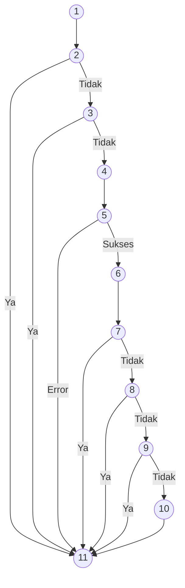
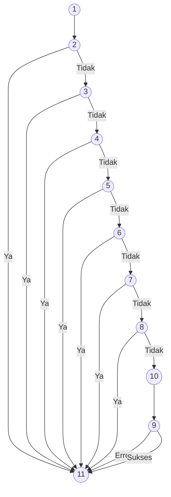
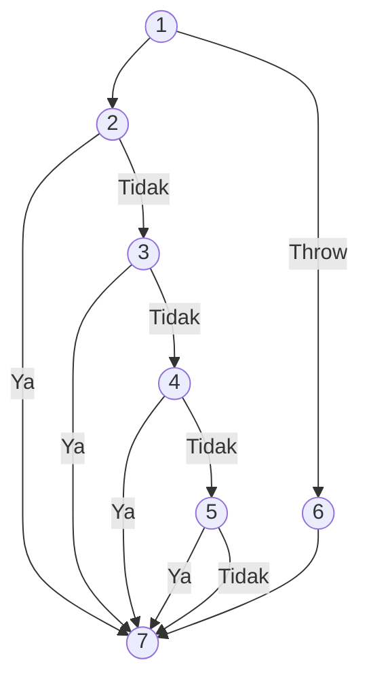
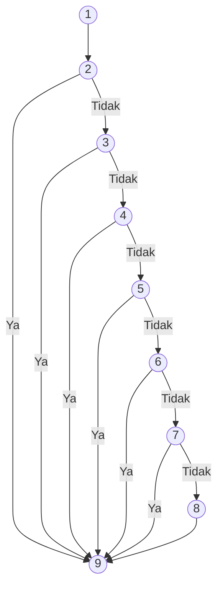
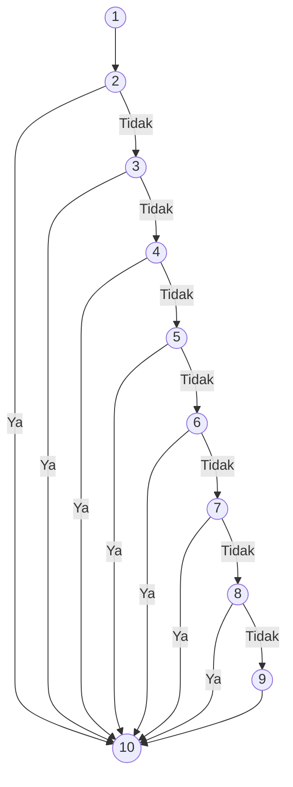
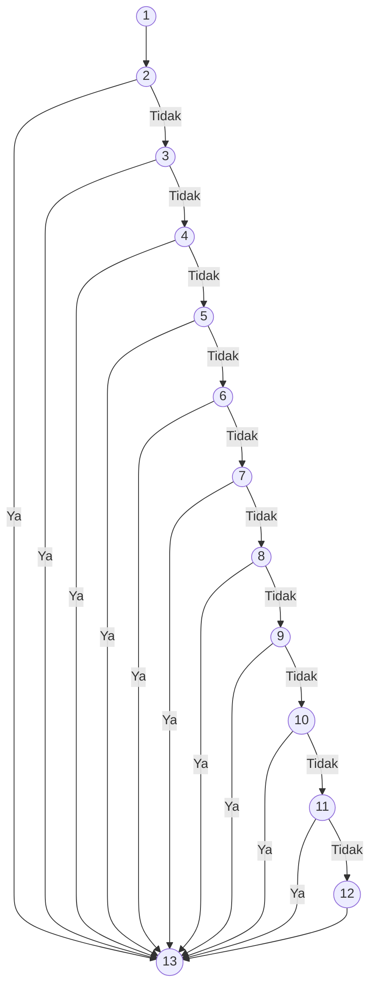
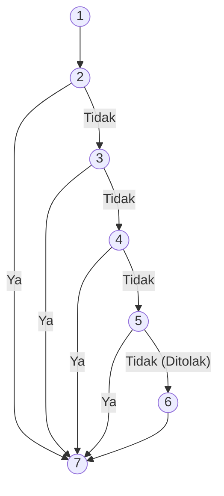
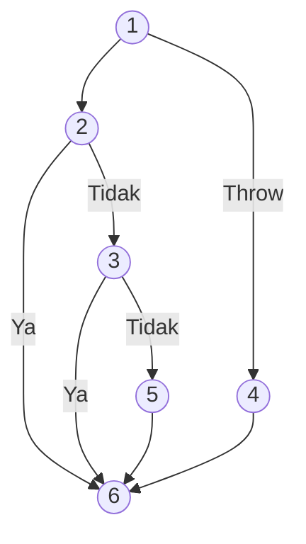

# Analisis White-Box Testing & Cyclomatic Complexity

Dokumen ini berisi pemodelan **Node Program**, **Flow Graph / Flow Chart (berbasis Mermaid)**, serta perhitungan **Cyclomatic Complexity (CC)** untuk 9 modul utama pada sistem Desa Digital. Hasil dari perhitungan $V(G)$ pada setiap modul terbukti setara dengan jumlah *independent paths* yang telah kita uji menggunakan skrip Jest (Total 66 Path).

Rumus Cyclomatic Complexity:
$$V(G) = E - N + 2$$
Atau berdasarkan jumlah Predicate Node (P):
$$V(G) = P + 1$$

---

## 1. Modul Autentikasi Login (9 Path)

### Tabel Node Program
| Node | Kode Program / Kondisi | Fungsi |
|---|---|---|
| 1 | `const onSubmit = async (e) => { ... }` | Start eksekusi form login |
| 2 | `if (!loginForm.email.includes("@"))` | Validasi format email salah |
| 3 | `if (loginForm.password.length < 6)` | Validasi panjang password kurang dari 6 |
| 4 | `await signInWithEmailAndPassword(...)` | Eksekusi login Firebase SDK |
| 5 | `catch (error)` (Firebase Error Handling) | Menangani error Firebase (email kosong, salah password, dll) |
| 6 | `const userDoc = await getDoc(...)` | Fetch data user dari Firestore |
| 7 | `if (!userDoc.exists())` | Cek keberadaan user doc di database |
| 8 | `if (userRole === "admin")` | Pengecekan role admin |
| 9 | `else if (userRole === "ministry")` | Pengecekan role ministry |
| 10 | `else` | Redirect ke role village / innovator |
| 11 | `}` | End eksekusi |

### Flow Graph (Mermaid)

**Perhitungan Cyclomatic Complexity:**
- Nodes ($N$) = 11
- Edges ($E$) = 18
- $V(G) = 18 - 11 + 2 = 9$ Path

---

## 2. Modul Autentikasi Register (9 Path)

### Tabel Node Program
| Node | Kode Program / Kondisi | Fungsi |
|---|---|---|
| 1 | `const onSubmit = async (e) => { ... }` | Start eksekusi form register |
| 2 | `if (!selectedRole)` | Validasi role tidak dipilih |
| 3 | `if (isGoogleSignIn)` | Pengecekan tombol Google Sign In |
| 4 | `if (!email.includes("@"))` | Validasi email tidak sesuai format |
| 5 | `if (!email || !password)` | Validasi input email & password kosong |
| 6 | `if (password.length < 6)` | Validasi panjang password |
| 7 | `if (!confirmPassword)` | Validasi konfirmasi password kosong |
| 8 | `if (password !== confirmPassword)` | Validasi kesesuaian password |
| 9 | `catch (error)` (Firebase Auth Error) | Penanganan email sudah digunakan (already in use) |
| 10 | `await createUserWithEmailAndPassword(...)` | Proses penyimpanan ke database |
| 11 | `}` | End eksekusi |

### Flow Graph (Mermaid)

**Perhitungan Cyclomatic Complexity:**
- Nodes ($N$) = 11
- Edges ($E$) = 18
- $V(G) = 18 - 11 + 2 = 9$ Path

---

## 3. Modul Validasi Auth / Me (6 Path)

### Tabel Node Program
| Node | Kode Program / Kondisi | Fungsi |
|---|---|---|
| 1 | `export async function GET(req) { ... }` | Start Endpoint |
| 2 | `if (!authHeader || !authHeader.startsWith("Bearer "))` | Pengecekan ketiadaan Token Header |
| 3 | `if (!decodedToken || !decodedToken.uid)` | Pengecekan Token Invalid/Gagal Decode |
| 4 | `if (!user)` | Pengecekan apakah user ada di DB MongoDB |
| 5 | `if (user.role !== decodedToken.role)` | Pengecekan ketidaksamaan role (Auto-sync) |
| 6 | `catch (error)` | Catch blok untuk Internal Server Error (DB Putus) |
| 7 | `return NextResponse.json(...)` | End: Mengembalikan Data User (200 OK) |

### Flow Graph (Mermaid)

**Perhitungan Cyclomatic Complexity:**
- Nodes ($N$) = 7
- Edges ($E$) = 11
- $V(G) = 11 - 7 + 2 = 6$ Path

---

## 4. Modul Profil Desa (7 Path)

### Tabel Node Program
| Node | Kode Program / Kondisi | Fungsi |
|---|---|---|
| 1 | `export async function POST(req) { ... }` | Start eksekusi POST Profil Desa |
| 2 | `if (auth instanceof NextResponse)` | Verifikasi token dan role (401/403) |
| 3 | `if (!namaDesa || !deskripsi || !lokasi || !potensiDesa)` | Validasi field wajib kosong |
| 4 | `if (validateWordLimit(deskripsi) > 100)` | Validasi batas kata deskripsi desa |
| 5 | `if (!user)` | Cek pengguna di koleksi users MongoDB |
| 6 | `if (user.role !== 'village')` | Validasi konsistensi role user |
| 7 | `if (existingVillage)` | Cek duplikasi (409 Conflict) profil desa |
| 8 | `await collection.insertOne(...)` | Simpan profil desa & Invalidate Cache |
| 9 | `}` | End Endpoint |

### Flow Graph (Mermaid)

**Perhitungan Cyclomatic Complexity:**
- Nodes ($N$) = 9
- Edges ($E$) = 14
- $V(G) = 14 - 9 + 2 = 7$ Path

---

## 5. Modul Profil Inovator (7 Path)

### Tabel Node Program
| Node | Kode Program / Kondisi | Fungsi |
|---|---|---|
| 1 | `export async function POST(req) { ... }` | Start eksekusi POST Profil Inovator |
| 2 | `if (auth instanceof NextResponse)` | Verifikasi token dan role (401/403) |
| 3 | `if (!namaInovator || !deskripsi || !kategori)` | Validasi field wajib kosong |
| 4 | `if (validateWordLimit(namaInovator) > 10 || ...)` | Validasi batas kata |
| 5 | `if (!targetUser && auth.uid !== targetId)` | Gagal auto-sync user jika tidak ada di DB |
| 6 | `if (targetUser.role !== 'innovator')` | Validasi role harus innovator |
| 7 | `if (existingInnovator)` | Cek duplikasi (409 Conflict) profil inovator |
| 8 | `await collection.insertOne(...)` | Simpan data & Invalidate Cache |
| 9 | `}` | End Endpoint |

### Flow Graph (Mermaid)

**Perhitungan Cyclomatic Complexity:**
- Nodes ($N$) = 9
- Edges ($E$) = 14
- $V(G) = 14 - 9 + 2 = 7$ Path

---

## 6. Modul Inovasi (8 Path)

### Tabel Node Program
| Node | Kode Program / Kondisi | Fungsi |
|---|---|---|
| 1 | `export async function POST(req) { ... }` | Start eksekusi POST Inovasi |
| 2 | `if (auth instanceof NextResponse)` | Pengecekan token & role (hanya Innovator/Admin) |
| 3 | `if (!kategori || !namaInovasi || ... )` | Pengecekan field teks yang kosong |
| 4 | `if (!Array.isArray(...) || array.length === 0)` | Pengecekan field array (manfaat, infrastruktur) kosong |
| 5 | `if (validateWordLimit(deskripsi) > 80)` | Pengecekan batas kata deskripsi (80 kata) |
| 6 | `if (validateWordLimit(inputDesaMenerapkan) > 20)` | Pengecekan batas kata lokasi penerapan (20 kata) |
| 7 | `if (modelBisnis.some(word > 5))` | Pengecekan elemen string pada array model bisnis (> 5 kata) |
| 8 | `if (!innovatorProfile || status !== 'Terverifikasi')` | Verifikasi status Innovator di koleksi MongoDB |
| 9 | `await collection.insertOne(...)` | Simpan Inovasi, hapus cache, kirim notif |
| 10| `}` | End Endpoint |

### Flow Graph (Mermaid)

**Perhitungan Cyclomatic Complexity:**
- Nodes ($N$) = 10
- Edges ($E$) = 16
- $V(G) = 16 - 10 + 2 = 8$ Path

---

## 7. Modul Klaim Desa (11 Path)

### Tabel Node Program
| Node | Kode Program / Kondisi | Fungsi |
|---|---|---|
| 1 | `export async function POST(req) { ... }` | Start eksekusi POST Klaim |
| 2 | `if (auth instanceof NextResponse)` | Cek role (harus village/admin) |
| 3 | `if (!desaId || !inovasiId || ...)` | Field wajib kosong |
| 4 | `if (!buktiJenis || buktiJenis.length === 0)` | Jenis bukti (checkbox) kosong |
| 5 | `if (wordLimit(deskripsiInovasi) > 80 || ...)` | Validasi batas kata |
| 6 | `if (!buktiFiles)` | Object array lampiran kosong |
| 7 | `if (buktiJenis.includes("Foto") && !buktiFiles.foto)` | Validasi integrasi field Foto |
| 8 | `if (buktiJenis.includes("Video") && !buktiFiles.video)`| Validasi integrasi field Video |
| 9 | `if (buktiJenis.includes("Dokumen") && !buktiFiles.dokumen)`| Validasi integrasi field Dokumen |
| 10| `if (!villageProfile || status !== 'Terverifikasi')` | Cek status desa belum terverifikasi |
| 11| `if (existingClaim)` | Cek klaim ganda (Conflict) |
| 12| `await collection.insertOne(...)` | Submit Klaim & Notifikasi |
| 13| `}` | End Endpoint |

### Flow Graph (Mermaid)

**Perhitungan Cyclomatic Complexity:**
- Nodes ($N$) = 13
- Edges ($E$) = 22
- $V(G) = 22 - 13 + 2 = 11$ Path

---

## 8. Modul Verifikasi Klaim Admin (5 Path)

### Tabel Node Program
| Node | Kode Program / Kondisi | Fungsi |
|---|---|---|
| 1 | `export async function POST(req) { ... }` | Start eksekusi Verify Claims |
| 2 | `if (auth instanceof NextResponse)` | Cek role (harus admin) |
| 3 | `if (!id)` | ID parameter routing kosong |
| 4 | `if (!claim)` | ID Klaim tidak ditemukan di DB (404) |
| 5 | `if (status === 'Terverifikasi')` | Status klaim = Disetujui (Sinkronisasi Data DB) |
| 6 | `else` | Status klaim = Ditolak |
| 7 | `}` | End Endpoint |

### Flow Graph (Mermaid)

**Perhitungan Cyclomatic Complexity:**
- Nodes ($N$) = 7
- Edges ($E$) = 10
- $V(G) = 10 - 7 + 2 = 5$ Path

---

## 9. Modul Rekomendasi AI (4 Path)

### Tabel Node Program
| Node | Kode Program / Kondisi | Fungsi |
|---|---|---|
| 1 | `export async function POST(req) { ... }` | Start eksekusi Rekomendasi AI |
| 2 | `if (!innovation_id)` | Payload ID kosong |
| 3 | `if (cached)` | Data ditemukan di Cache Redis/Memory |
| 4 | `catch (error)` | Simulasi API Eksternal (FastAPI) mati/error (500) |
| 5 | `await axios.post(...)` | API eksternal sukses (Write Cache & 200 OK) |
| 6 | `}` | End Endpoint |

### Flow Graph (Mermaid)

**Perhitungan Cyclomatic Complexity:**
- Nodes ($N$) = 6
- Edges ($E$) = 8
- $V(G) = 8 - 6 + 2 = 4$ Path
