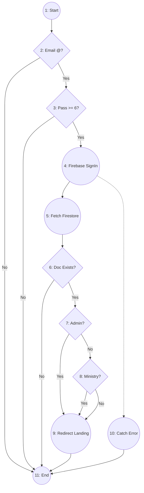
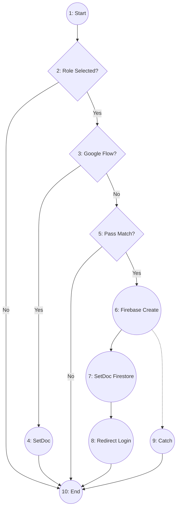

# Whitebox Testing - Basis Path Testing Report
## Project: Desa Digital v3

Laporan ini menyajikan analisis pengujian Whitebox dengan metode **Basis Path Testing**. Setiap fitur dianalisis jalurnya secara independen dan dipetakan ke dalam Test Case untuk memastikan seluruh logika program telah diuji.

---

## 1. Fitur: Login (Frontend)
**File:** `src/app/auth/login/page.tsx`

### Pemetaan Kode ke Node
| Kode Program | Node | Fungsi |
| :--- | :---: | :--- |
| `const onSubmit = async (event) => {` | 1 | Start |
| `if (!loginForm.email.includes("@"))` | 2 | Validasi Format Email |
| `if (loginForm.password.length < 6)` | 3 | Validasi Panjang Password |
| `await signInWithEmailAndPassword(...)` | 4 | Eksekusi Login Firebase SDK |
| `const userDoc = await getDoc(...)` | 5 | Fetch Data User dari Firestore |
| `if (!userDoc.exists())` | 6 | Cek keberadaan User Doc |
| `if (userRole === "admin")` | 7 | Pengecekan Role Admin |
| `else if (userRole === "ministry")` | 8 | Pengecekan Role Ministry |
| `router.push(...)` | 9 | Redirect ke Dashboard Sesuai Role |
| `catch (error)` | 10 | Error Handling (Firebase Auth Error) |
| `}` | 11 | End |

### Flow Graph

### Perhitungan Complexity & Independent Path
*   **Cyclomatic Complexity ($V(G)$)**: 5 predikat (Node 2, 3, 6, 7, 8) + 1 = **6**
*   **Independent Paths**:
    1.  **Path 1**: 1-2-11 (Email tidak valid)
    2.  **Path 2**: 1-2-3-11 (Password < 6 karakter)
    3.  **Path 3**: 1-2-3-4-5-6-11 (User Doc tidak ditemukan di Firestore)
    4.  **Path 4**: 1-2-3-4-5-6-7-9-11 (Login Admin Berhasil)
    5.  **Path 5**: 1-2-3-4-5-6-7-8-9-11 (Login Ministry/Desa Berhasil)
    6.  **Path 6**: 1-2-3-4-10-11 (Error pada Firebase Auth)

---

## 2. Fitur: Register (Frontend)
**File:** `src/app/auth/register/page.tsx`

### Flow Graph

### Perhitungan Complexity & Independent Path
*   **Cyclomatic Complexity ($V(G)$)**: 4 predikat (Node 2, 3, 5, 6-implicit) + 1 = **5**
*   **Independent Paths**:
    1.  **Path 1**: 1-2-10 (Role belum dipilih)
    2.  **Path 2**: 1-2-3-4-10 (Registrasi via Google Berhasil)
    3.  **Path 3**: 1-2-3-5-10 (Password & Konfirmasi tidak cocok)
    4.  **Path 4**: 1-2-3-5-6-7-8-10 (Registrasi Standar Berhasil)
    5.  **Path 5**: 1-2-3-5-6-9-10 (Error: Email sudah terdaftar/Firebase Error)

---

## 3. Fitur: Add Innovations
**File:** `src/app/innovation/add/page.tsx`

### Perhitungan Complexity & Independent Path
*   **Cyclomatic Complexity ($V(G)$)**: 3 predikat + 1 = **4**
*   **Independent Paths**:
    1.  **Path 1**: 1-2-9 (Form belum lengkap)
    2.  **Path 2**: 1-2-3-4-5-7-9 (Resubmit/Update Inovasi Ditolak Berhasil)
    3.  **Path 3**: 1-2-3-4-6-7-9 (Tambah Inovasi Baru Berhasil)
    4.  **Path 4**: 1-2-3-4-6-8-9 (Error saat simpan data/upload file)

---

## 4. Fitur: Profile Form (Innovator/Desa)
**File:** `src/app/innovator/form/page.tsx`

### Perhitungan Complexity & Independent Path
*   **Cyclomatic Complexity ($V(G)$)**: 2 predikat + 1 = **3**
*   **Independent Paths**:
    1.  **Path 1**: 1-2-3-4-6-8 (Update Profil Berhasil)
    2.  **Path 2**: 1-2-3-5-6-8 (Buat Profil Baru Berhasil)
    3.  **Path 3**: 1-2-3-5-7-8 (Error Catch: Gagal simpan ke DB)

---

## 5. Fitur: Claim Innovations (Standard & Manual)
**File:** `src/app/village/claim/[id]/page.tsx`

### Perhitungan Complexity & Independent Path
*   **Cyclomatic Complexity ($V(G)$)**: 4 predikat + 1 = **5**
*   **Independent Paths**:
    1.  **Path 1**: 1-2-10 (Belum pilih jenis bukti)
    2.  **Path 2**: 1-2-3-10 (File bukti belum lengkap diunggah)
    3.  **Path 3**: 1-2-3-4-5-6-8-10 (Klaim Manual Berhasil)
    4.  **Path 4**: 1-2-3-4-5-7-8-10 (Klaim Standard Berhasil)
    5.  **Path 5**: 1-2-3-4-5-7-9-10 (Error saat proses pengajuan klaim)

---

## 6. Fitur: Verifikasi Admin
**File:** `src/app/api/admin/verify/...`

### Perhitungan Complexity & Independent Path
*   **Cyclomatic Complexity ($V(G)$)**: 2 predikat + 1 = **3**
*   **Independent Paths**:
    1.  **Path 1**: 1-2-3-6-7-9 (Admin menyetujui pengajuan)
    2.  **Path 2**: 1-2-4-5-6-7-9 (Admin menolak pengajuan + catatan)
    3.  **Path 3**: 1-2-3-6-8-9 (Error teknis/koneksi saat update status)

---

## 8. Tabel Test Case (Berdasarkan Independent Path)

| ID | Feature | Path | Skenario Pengujian | Hasil yang Diharapkan |
| :--- | :--- | :--- | :--- | :--- |
| **L-01** | Login | Path 1 | Masukkan email tanpa "@" | Toast: "Email tidak valid" |
| **L-02** | Login | Path 2 | Masukkan password < 6 karakter | Toast: "Password minimal 6" |
| **L-03** | Login | Path 3 | Login dengan email yang tidak terdaftar di Firestore | Toast: "Data tidak ditemukan" |
| **L-04** | Login | Path 4 | Login dengan kredensial Admin valid | Redirect ke `/admin` |
| **L-05** | Login | Path 5 | Login dengan kredensial Desa/Ministry valid | Redirect ke `/dashboard` / Landing |
| **L-06** | Login | Path 6 | Putuskan koneksi saat klik Login | Toast Error (Firebase Catch) |
| **R-01** | Register | Path 1 | Klik daftar tanpa memilih Role | Toast: "Pilih daftar sebagai" |
| **R-02** | Register | Path 2 | Daftar menggunakan akun Google | Akun tersimpan & Redirect |
| **R-03** | Register | Path 3 | Konfirmasi password tidak sama | Toast: "Password tidak cocok" |
| **R-04** | Register | Path 4 | Registrasi email baru yang valid | Akun dibuat & Redirect Login |
| **R-05** | Register | Path 5 | Daftar dengan email yang sudah ada | Pesan Error: "Email exists" |
| **AI-01** | Add Inno | Path 1 | Klik submit dengan field wajib kosong | Form tidak terkirim (Alert) |
| **AI-02** | Add Inno | Path 2 | Update inovasi yang sebelumnya Ditolak | Status berubah jadi 'Menunggu' |
| **AI-03** | Add Inno | Path 3 | Tambah inovasi baru dari awal | Inovasi masuk ke DB |
| **AI-04** | Add Inno | Path 4 | Upload file yang korup/terputus | Toast Error (Catch) |
| **PF-01** | Profile | Path 1 | Edit data pada profil yang sudah ada | Data di DB ter-update |
| **PF-02** | Profile | Path 2 | Mengisi profil untuk pertama kali | Dokumen profil baru dibuat |
| **PF-03** | Profile | Path 3 | Gagal simpan profil karena error server | Muncul pesan Error Catch |
| **CL-01** | Claim | Path 1 | Klik klaim tanpa memilih jenis bukti | Toast: "Pilih minimal 1 bukti" |
| **CL-02** | Claim | Path 2 | Pilih bukti tapi tidak upload file | Toast: "Lengkapi bukti" |
| **CL-03** | Claim | Path 3 | Lakukan klaim inovasi manual | Data klaim manual masuk ke DB |
| **CL-04** | Claim | Path 4 | Lakukan klaim inovasi dari list | Data klaim list masuk ke DB |
| **CL-05** | Claim | Path 5 | Error API saat submit klaim | Toast Error (Catch) |
| **VA-01** | Verify | Path 1 | Admin klik tombol 'Verify' | Status: 'Terverifikasi' |
| **VA-02** | Verify | Path 2 | Admin klik 'Reject' + input alasan | Status: 'Ditolak' + catatan |
| **VA-03** | Verify | Path 3 | Gagal update status (Internal Server Error) | Log Catch Error ditampilkan |

---
**Total Test Case: 26 (Sesuai dengan akumulasi Independent Paths)**
