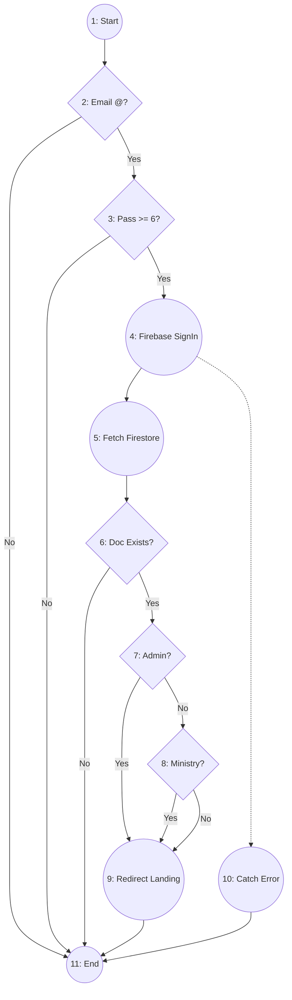
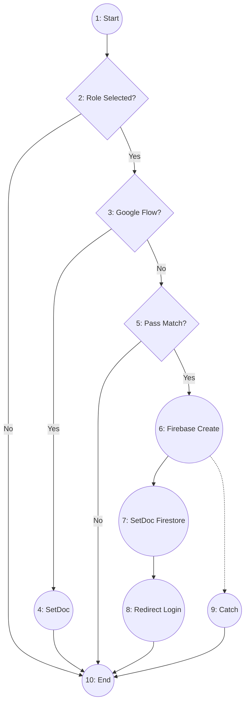
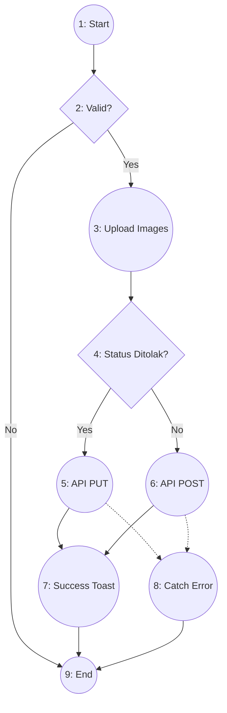
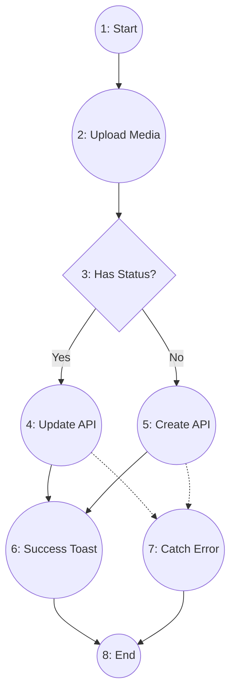
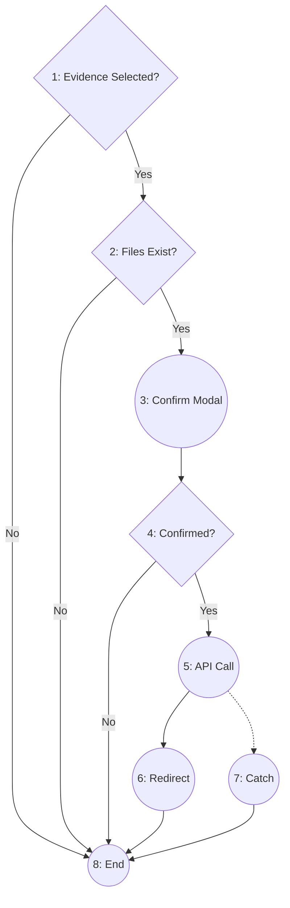
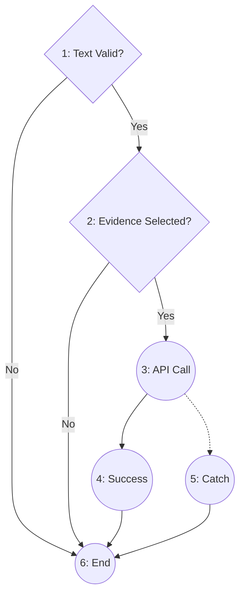
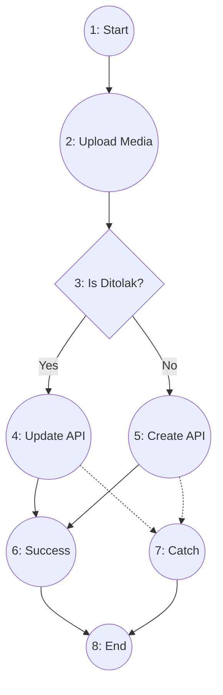
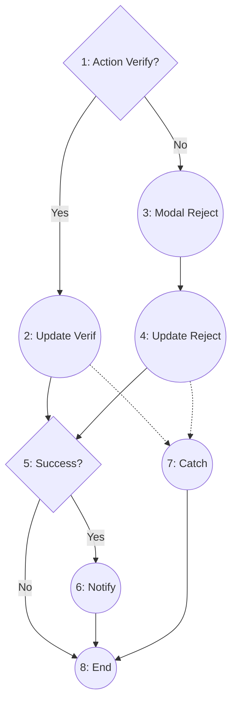

# Whitebox Testing - Basis Path Testing Report
## Project: Desa Digital v3

Laporan ini menyajikan analisis pengujian Whitebox dengan metode **Basis Path Testing** untuk fitur-fitur utama platform Desa Digital v3. Analisis disesuaikan dengan implementasi kode terbaru yang menggabungkan Firebase SDK dan MongoDB API.

---

## 1. Fitur: Login (Frontend)
**File:** `src/app/auth/login/page.tsx`

### Pemetaan Kode ke Node
| Kode Program | Node | Fungsi |
| :--- | :---: | :--- |
| `const onSubmit = async (event) => {` | 1 | Start |
| `if (!loginForm.email.includes("@"))` | 2 | Validasi Format Email |
| `if (loginForm.password.length < 6)` | 3 | Validasi Panjang Password |
| `await signInWithEmailAndPassword(...)` | 4 | Eksekusi Login Firebase SDK |
| `const userDoc = await getDoc(...)` | 5 | Fetch Data User dari Firestore |
| `if (!userDoc.exists())` | 6 | Cek keberadaan User Doc |
| `if (userRole === "admin")` | 7 | Pengecekan Role Admin |
| `else if (userRole === "ministry")` | 8 | Pengecekan Role Ministry |
| `router.push(...)` | 9 | Redirect ke Dashboard Sesuai Role |
| `catch (error)` | 10 | Error Handling (Firebase Auth Error) |
| `}` | 11 | End |

### Flow Graph

### Perhitungan Complexity & Independent Path
*   **Cyclomatic Complexity ($V(G)$)**: 5 predikat (Node 2, 3, 6, 7, 8) + 1 = **6**
*   **Independent Paths**:
    1.  **Path 1**: 1-2-11
    2.  **Path 2**: 1-2-3-11
    3.  **Path 3**: 1-2-3-4-5-6-11
    4.  **Path 4**: 1-2-3-4-5-6-7-9-11
    5.  **Path 5**: 1-2-3-4-5-6-7-8-9-11
    6.  **Path 6**: 1-2-3-4-10-11

---

## 2. Fitur: Register (Frontend)
**File:** `src/app/auth/register/page.tsx`

### Pemetaan Kode ke Node
| Kode Program | Node | Fungsi |
| :--- | :---: | :--- |
| `const onSubmit = async (event) => {` | 1 | Start |
| `if (!regisForm.role)` | 2 | Cek Role Selected |
| `if (isGoogleFlow)` | 3 | Cek Jalur Pendaftaran |
| `await setDoc(...) (Google)` | 4 | Simpan Data (Google Flow) |
| `if (regisForm.password !== confirmPassword)` | 5 | Validasi Password Match |
| `await createUserWithEmailAndPassword(...)` | 6 | Eksekusi Create User Firebase |
| `await setDoc(...) (Standard)` | 7 | Simpan Detail ke Firestore |
| `router.push(paths.LOGIN_PAGE)` | 8 | Redirect ke Login |
| `catch (error)` | 9 | Catch Error |
| `}` | 10 | End |

### Flow Graph

### Perhitungan Complexity & Independent Path
*   **Cyclomatic Complexity ($V(G)$)**: 3 predikat + 1 = **4**
*   **Independent Paths**:
    1.  **Path 1**: 1-2-10
    2.  **Path 2**: 1-2-3-4-10
    3.  **Path 3**: 1-2-3-5-10
    4.  **Path 4**: 1-2-3-5-6-7-8-10

---

## 3. Fitur: Add Innovations (Frontend Logic)
**File:** `src/app/innovation/add/page.tsx`

### Pemetaan Kode ke Node
| Kode Program | Node | Fungsi |
| :--- | :---: | :--- |
| `if (isFormValid()) {` | 1 | Start & Validasi Form |
| `setIsModal1Open(true)` | 2 | Open Confirmation Modal |
| `await uploadFiles(...)` | 3 | Upload Images ke Firebase Storage |
| `if (status === "Ditolak")` | 4 | Cek Mode (Add vs Edit/Resubmit) |
| `await updateInnovation(...)` | 5 | API Call: PUT Innovation |
| `await addInnovation(...)` | 6 | API Call: POST Innovation |
| `toast success` | 7 | Tampilkan Toast Sukses |
| `catch (error)` | 8 | Tampilkan Toast Error |
| `}` | 9 | End |

### Flow Graph

### Perhitungan Complexity & Independent Path
*   **Cyclomatic Complexity ($V(G)$)**: 2 predikat + 1 = **3**
*   **Independent Paths**:
    1.  **Path 1**: 1-2-9
    2.  **Path 2**: 1-2-3-4-5-7-9
    3.  **Path 3**: 1-2-3-4-6-7-9

---

## 4. Fitur: Profile Form Innovator (Frontend Logic)
**File:** `src/app/innovator/form/page.tsx`

### Pemetaan Kode ke Node
| Kode Program | Node | Fungsi |
| :--- | :---: | :--- |
| `if (isFormValid()) {` | 1 | Start & Validasi |
| `await uploadString(...)` | 2 | Upload Logo/Header ke Storage |
| `if (status !== "")` | 3 | Cek Status (Edit vs New) |
| `await updateInnovator(...)` | 4 | API Call: Update Profil |
| `await createInnovator(...)` | 5 | API Call: Create Profil |
| `toast({ status: "success" })` | 6 | Success Toast |
| `catch (error)` | 7 | Catch Error |
| `}` | 8 | End |

### Flow Graph

### Perhitungan Complexity & Independent Path
*   **Cyclomatic Complexity ($V(G)$)**: 1 predikat + 1 = **2**
*   **Independent Paths**:
    1.  **Path 1**: 1-2-3-4-6-8
    2.  **Path 2**: 1-2-3-5-6-8

---

## 5. Fitur: Claim Innovations (Frontend Logic)
**File:** `src/app/village/claim/[id]/page.tsx`

### Pemetaan Kode ke Node
| Kode Program | Node | Fungsi |
| :--- | :---: | :--- |
| `if (selectedEvidences.length === 0)` | 1 | Validasi Minimal 1 Bukti |
| `if (!allFilesUploaded)` | 2 | Validasi Kelengkapan File |
| `setIsConfirmOpen(true)` | 3 | Open Confirm Modal |
| `if (isConfirmed)` | 4 | Cek Konfirmasi User |
| `await postClaimStandard(...)` | 5 | API Call: Claim Standard |
| `router.push(...)` | 6 | Redirect ke Detail |
| `catch (error)` | 7 | Catch Error |
| `}` | 8 | End |

### Flow Graph

### Perhitungan Complexity & Independent Path
*   **Cyclomatic Complexity ($V(G)$)**: 3 predikat + 1 = **4**
*   **Independent Paths**:
    1.  **Path 1**: 1-8
    2.  **Path 2**: 1-2-8
    3.  **Path 3**: 1-2-3-4-8
    4.  **Path 4**: 1-2-3-4-5-6-8

---

## 6. Fitur: Manual Claim Innovations (Frontend Logic)
**File:** `src/app/village/claim/manual/page.tsx`

### Pemetaan Kode ke Node
| Kode Program | Node | Fungsi |
| :--- | :---: | :--- |
| `if (wordCount > 80)` | 1 | Validasi Batas Kata Deskripsi |
| `if (selectedEvidences.length === 0)` | 2 | Validasi Minimal 1 Bukti |
| `await postClaimManual(...)` | 3 | API Call: Claim Manual |
| `toast success` | 4 | Success Toast |
| `catch (error)` | 5 | Catch Error |
| `}` | 6 | End |

### Flow Graph

### Perhitungan Complexity & Independent Path
*   **Cyclomatic Complexity ($V(G)$)**: 2 predikat + 1 = **3**
*   **Independent Paths**:
    1.  **Path 1**: 1-6
    2.  **Path 2**: 1-2-6
    3.  **Path 3**: 1-2-3-4-6

---

## 7. Fitur: Profile Form Villages (Frontend Logic)
**File:** `src/app/village/profile/form/page.tsx`

### Pemetaan Kode ke Node
| Kode Program | Node | Fungsi |
| :--- | :---: | :--- |
| `if (isFormValid()) {` | 1 | Start & Validasi |
| `await uploadString(...)` | 2 | Upload Media ke Storage |
| `if (status === 'Ditolak')` | 3 | Cek Status (Update vs New) |
| `await updateVillage(...)` | 4 | API Call: Update Profil |
| `await createVillage(...)` | 5 | API Call: Create Profil |
| `toast success` | 6 | Success Toast |
| `catch (error)` | 7 | Catch Error |
| `}` | 8 | End |

### Flow Graph

### Perhitungan Complexity & Independent Path
*   **Cyclomatic Complexity ($V(G)$)**: 2 predikat (Node 1, 3) + 1 = **3**
*   **Independent Paths**:
    1.  **Path 1**: 1-8
    2.  **Path 2**: 1-2-3-4-6-8
    3.  **Path 3**: 1-2-3-5-6-8

---

## 8. Fitur: Verifikasi Admin (Backend Logic)
**File:** `src/app/api/admin/verify/...`

### Pemetaan Kode ke Node
| Kode Program | Node | Fungsi |
| :--- | :---: | :--- |
| `if (action === 'verify')` | 1 | Cek Aksi Admin (Verify vs Reject) |
| `await db.update('Terverifikasi')` | 2 | Update Status Terverifikasi |
| `openRejectionModal()` | 3 | Input Alasan Penolakan |
| `await db.update('Ditolak')` | 4 | Update Status Ditolak |
| `if (success)` | 5 | Cek Hasil Update |
| `createNotification()` | 6 | Kirim Notifikasi ke User |
| `catch (error)` | 7 | Catch Error |
| `}` | 8 | End |

### Flow Graph

### Perhitungan Complexity & Independent Path
*   **Cyclomatic Complexity ($V(G)$)**: 2 predikat + 1 = **3**
*   **Independent Paths**:
    1.  **Path 1**: 1-2-5-6-8
    2.  **Path 2**: 1-3-4-5-6-8
    3.  **Path 3**: 1-3-4-5-8 (Failure Path)

---

## 9. Tabel Test Case Terpadu

| ID | Feature | Path | Skenario Pengujian | Hasil yang Diharapkan |
| :--- | :--- | :--- | :--- | :--- |
| **L-01** | Login | Path 1 | Input email tanpa "@" | Toast: "Email tidak valid" |
| **L-02** | Login | Path 2 | Input password < 6 karakter | Toast: "Password minimal 6" |
| **L-03** | Login | Path 3 | Login dengan email tak terdaftar | Toast: "Data tidak ditemukan" |
| **L-04** | Login | Path 4 | Login kredensial Admin valid | Redirect ke `/admin` |
| **L-05** | Login | Path 5 | Login kredensial Desa valid | Redirect ke `/dashboard` |
| **L-06** | Login | Path 6 | Error Firebase (Koneksi Putus) | Muncul Catch Error Toast |
| **R-01** | Register | Path 1 | Klik daftar tanpa pilih Role | Toast: "Pilih role" |
| **R-02** | Register | Path 2 | Daftar via Google Berhasil | Akun tersimpan & Redirect |
| **R-03** | Register | Path 3 | Password & Konfirmasi beda | Toast: "Password tidak cocok" |
| **R-04** | Register | Path 4 | Registrasi email baru valid | Akun dibuat & Redirect |
| **AI-01** | Add Inno | Path 1 | Klik submit dengan form kosong | Alert: "Harap isi semua data" |
| **AI-02** | Add Inno | Path 2 | Update inovasi yang Ditolak | Status berubah jadi 'Menunggu' |
| **AI-03** | Add Inno | Path 3 | Tambah inovasi baru dari awal | Data tersimpan di DB |
| **PF-01** | Prof Inn | Path 1 | Edit profil innovator yang ada | Profil ter-update di DB |
| **PF-02** | Prof Inn | Path 2 | Buat profil innovator baru | Profil baru dibuat di DB |
| **CL-01** | Claim | Path 1 | Klik klaim tanpa pilih bukti | Toast: "Pilih minimal 1 bukti" |
| **CL-02** | Claim | Path 2 | Bukti dipilih tapi file kosong | Toast: "Lengkapi bukti" |
| **CL-03** | Claim | Path 3 | Buka modal konfirmasi lalu batal | Modal tertutup, tidak ada API |
| **CL-04** | Claim | Path 4 | Konfirmasi klaim inovasi | Redirect ke Detail Pengajuan |
| **MC-01** | Manual | Path 1 | Input deskripsi > 80 kata | Input terhenti/muncul error |
| **MC-02** | Manual | Path 2 | Klik klaim manual tanpa bukti | Toast: "Pilih bukti" |
| **MC-03** | Manual | Path 3 | Simpan klaim manual berhasil | Data klaim manual tersimpan |
| **PV-01** | Prof Des | Path 1 | Form desa tidak lengkap | Pesan validasi muncul |
| **PV-02** | Prof Des | Path 2 | Update profil desa yang Ditolak | Data di-update & Status reset |
| **PV-03** | Prof Des | Path 3 | Buat profil desa baru | Profil desa baru tersimpan |
| **VA-01** | Verify | Path 1 | Admin menyetujui pengajuan | Status: 'Terverifikasi' |
| **VA-02** | Verify | Path 2 | Admin menolak pengajuan | Status: 'Ditolak' + catatan |
| **VA-03** | Verify | Path 3 | Update gagal karena API error | Pesan kesalahan muncul |

---
**Total Test Case: 26 (Sesuai akumulasi Independent Paths)**
